# Systematization of Knowledge (SoK) AI with Code - DevGun 🇰🇷

<p align="center">
    
</p>
<br/>

## Table of Contents

##### 인공지능 기술 개요

- 인공지능 제반 기술 개요 및 주요 특징
  - 인공지능(Artificial Intelligence, AI)의 개요 및 역사
    - 인공지능의 개념과 정의
    - 인공지능 역사
    - 범용인공지능(AGI, Artificial General Intelligence)
  - 인공지능의 주요 특징
    - 추론과 문제해결
      - 탐색
        - 맹목적 탐색(blind search) 방법
        - 휴리스틱 탐색(heuristic search)
        - 게임트리 탐색
          - Minimax Search
          - 알파베타 가지치기(Alpha-Beta Pruning) 기법
          - AlphaGo의 게임 탐색 알고리즘­몬테카를로 트리 탐색(Monte Carlo Tree Search, MCTS)
      - 추론
    - 지식표현과 문제 해결
      - 규칙처리 방식
      - 논리적 표현방식
      - 의미망(Semantic Network)
      - 틀 표현방식(Frame Representation)
    - 기계학습(machine learning)
  - 인공지능과 자율성
    - 개요
    - 인공지능과 창작
    - 인공지능의 추론 학습 능력, 관계형 네트워크(Relation Networks, RNs)

<br/>

##### ✅ 딥러닝

- **개요 및 신경망 구조**
  - **Deep Learning**
    - **딥러닝 개요**
    - **딥러닝 특징**
  - **Perceptron**
    - **Single-Layer Perceptron**
    - **Multi-Layer Perceptron**
    - **Deep Neural Network**
  - 신경망(Neural Network)의 구조
    - 인공신경망(Artificial Neural Networks, ANN)의 개요
    - 인경신경망의 구조
  - 다층신경망
  - 딥러닝 방식
    - 강화학습(Reinforcement Learning)
      - 강화학습의 개요
      - MDP(Markov Decision Process) 방식
      - DQN(Deep Q-Network)
      - 강화학습의 특징
    - GPU 방식 병렬컴퓨팅
      - GPU(Graphics Processing Unit, 그래픽 처리 장치)
      - GPGPU(General Purpose Graphics Processing Units)
        - MPI(Message Passing Interface, 메시지 전달 인터페이스)
        - CUDA(Compute Unified Device Architecture, 쿠다)
        - OpenCL(Open Computing Language)
        - TPU(Tensor Processing Unit, TPU)

##### 기계학습

- 클러스터링(Clustering)과 기계학습
- 기계번역

<br/>

##### 딥러닝 기술 동향

- 개요
- RNN과 LSTM
  - 순환신경망(Recurrent neural networks)
  - LSTM(Long-short term memory, 장단기 기억 구조)
- 컨볼루션 네트워크(CNN, convolutional neural networks, 합성곱신경망)
- GAN(Generative Adversarial Network. 생성 대립 신경망)
- 이미지인식 기술
- 자연어 처리(Natural Language Processing, NLP)
  - 자연어 처리(NLP) 개요
    - Word2Vec
    - RNN과 자연어 처리
    - CNN과 자연어 처리
  - 자연어 처리와 인공지능비서
    - 질의응답 시스템(question-answering system)
    - 대화시스템

<br/>

**인공지능 학습 GAN 기술동향**

- GAN(Generative Adversarial Network) 개요 및 학습 방법
  - GAN(Generative Adversarial Network, 적대적 생성 신경망) 개요 및 정의
    - GAN 개요
    - GAN 구조
      - 학습데이터
      - 생성자(generator) 네트워크
      - 판별자(discriminator) 네트워크
    -  적대적 학습 방법
- GAN 기술동향
  - GAN 기술동향 개요
  - GAN 응용 모델과 적용 사례
    - CGAN(Conditional GAN)
    - InfoGAN
    - Laplacian GAN
    - DCGAN(Deep Convolutional Generative Adversarial Networks)
    - DiscoGAN
- 인공지능의 향후 전망
  - 인공지능 시장 전망

   <br/>

```
[그림 1] 정보통신기술 계층과 디지털 커넥툼
[그림 2] 인공지능의 연구 흐름
[그림 3] 튜링테스트
[그림 4] 슈퍼비전팀의 연구 내용
[그림 5] 뉴런과 계층형 시간 메모리(HTM)가 모방한 인공신경망
[그림 6] 초인공지능
[그림 7] 인공지능에 의한 대재앙에 이르는 위험 모델
[그림 8] 너비우선탐색 알고리즘과 순서
[그림 9] 깊이우선 탐색(전위순회)의 과정
[그림 10] 휴리스틱 탐색의 한 예
[그림 11] tic-tac-toe 게임의 트리탐색 해결방법
[그림 12] Minimax
[그림 13] Alpha-Beta Pruning 알고리즘의 탐색 결과
[그림 14] 몬테카를로 트리탐색에서 단계별로 탐색을 확장하는 과정
[그림 15] 알파고의 컨볼루션 신경망 구조(정책, 가치 네트워크)
[그림 16] 지식표현
[그림 17] 의미망
[그림 18] 인간의 신경망을 모방한 인공지능 신경망
[그림 19] 전통적 프로그래밍(연역법)과 기계학습(귀납법) 패러다임 비교
[그림 20] 심층신경망을 활용한 조르주 쇠라 작 <그랑 자트 섬의 일요일>의 다양한 형태
[그림 21] 나선형 신경망(CNN)을 통한 스타일과 콘텐츠의 재구성 프로세스
[그림 22] LSTM 기반 음악 작곡(LSTM RNN Music Composition)
[그림 23] AI에 의한 자동 컬러링
[그림 24] 영화 her
[그림 25] 관계형 질문
[그림 26] 객체 유형(위)과 위치 지정 체계(좌우)
[그림 27] CNN을 이용한 관계 추론
[그림 28] 기계학습 절차
[그림 29] 딥러닝의 전체 흐름도
[그림 30] TensorFlow를 이용한 딥러닝
[그림 31] 기술 스택으로 본 딥러닝 프레임워크
[그림 32] 알파고의 Deep Neural Networks 학습 pipeline
[그림 33] 소비전력당 성능
[그림 34] 4차 산업혁명 작동원리
[그림 35] 인공신경망의 구조
[그림 36] 신경세포의 구성과 인공신경망
[그림 37] Training a student network using hints
[그림 38] 파라미터 공유 기법
[그림 39] 인공신경망 기본 형태
[그림 40] 다층신경망
[그림 41] 다층신경망 구조
[그림 42] 환경과 상호작용을 통한 강화학습 구조
[그림 43] 강화학습 프레임워크(Reinforcement Learning Framework)
[그림 44] 로봇에 적용된 DQN
[그림 45] q-learning
[그림 46] 마르코프 결정과정 문제(Markov Decision Process, MDP)
[그림 47] 딥마인드 DQN 구조
[그림 48] 미분 가능 신경컴퓨터의 아키텍처 구조
[그림 49] 강화와 처벌
[그림 50] 강화학습 시스템 구조
[그림 51] 그래픽 처리 장치
[그림 52] CUDA 지원 GPU의 아키텍처
[그림 53] GPU와 CPU의 소비 전력당 성능 비교
[그림 54] 데이터 병렬화
[그림 55] General MPI Program Structure
[그림 56] CUDA Application
[그림 57] CUDA 프로그램
[그림 58] OpenCL execution model
[그림 59] 구글 TPU의 구조
[그림 60] TPU의 매트릭스 승수 단위(MXU)
[그림 61] TensorFlow에서 TPU
[그림 62] 딥러닝
[그림 64] K-Means 알고리즘의 수행절차
[그림 65] 군집분석
[그림 66] 계층적 군집(Hierarchical Clutering)
[그림 67] 전통적 프로그래밍(연역법)과 기계학습(귀납법) 패러다임 비교
[그림 68] 인공신경망 기계번역
[그림 69] 구글의 신경망 기반 번역기 구조
[그림 70] Translation model
[그림 71] 인간과 교감하는 AI
[그림 72] Feedforward NN 대 RNN
[그림 73] Recurrent neural networks
[그림 74] Recurrent neural networks
[그림 75] Recurrent neural networks
[그림 76] RNN에서의 Vanishing Gradient Problem
[그림 77] LSTM의 개념
[그림 78] 순환신경망(좌)과 LSTM(우) 비교
[그림 79] Conv-LSTM Architecture
[그림 80] LSTM 유닛과 게이트의 작동 방식
[그림 81] Word Embedding Correlation model
[그림 82] GRU Gating
[그림 83] CNN을 이용한 객체 검출
[그림 84] CNN 활용 필기체 인식기술
[그림 85] 물체인식에 사용된 CNN
[그림 86] convolution 신경망
[그림 87] 전결합 레이어와 Convolution layer
[그림 88] CNN 훈련모델
[그림 89] Neural-image QA
[그림 90] generative model의 분류
[그림 91] Fake and real images
[그림 92] 뇌의 시각정보처리 과정과 딥러닝 이미지인식
[그림 93] 시각 정보를 프로세싱하는 과정의 예
[그림 94] 딥러닝 알고리즘을 활용한 얼굴인식 프로세스
[그림 95] 얼굴인식 과정 예시
[그림 96] 손글씨 이미지인식을 위한 인공신경망 개념도
[그림 97] 물체의 분류와 위치 식별 문제
[그림 98] 페이스북 딥페이스 동작 원리 모습
[그림 99] Camelyon16대회에서 선보인 앤드류 백(Andrew Beck)교수팀의 유방암 병리 슬라이드 판독
[그림 100] NLP 단계
[그림 101] 자연어 처리 기술
[그림 102] 형태소 분석
[그림 103] 문장 해석
[그림 104] Syntaxnet Architecture
[그림 105] DD차원 벡터로 표현된 단어 벡터
[그림 106] Training Data
[그림 107] CBOW Architecture
[그림 108] Skip-Gram 신경망 구조
[그림 109] CBOW와 Skip-gram의 차이
[그림 110] Encoder-Decoder 번역 모델
[그림 111] 문서 분류를 위한 계층적 Attention network
[그림 112] 순차적인 RNN 처리
[그림 113] CNN을 활용한 문장 분류 아키텍처
[그림 114] 질의응답 시스템
[그림 115] 인관관계 질의응답 시스템
[그림 116] 자연어시스템의 구성
[그림 117] 자연어 생성(Natural Language Generation)
[그림 118] 대화시스템 모델
[그림 119] 인지시스템의 요소
[그림 120] GAN의 개념도
[그림 121] GAN의 학습 방법
[그림 122] Generative Adversarial Network
[그림 123] Generative model
[그림 124] Adversarial Nets Framework
[그림 125] Generative Network
[그림 126] Discriminator Network
[그림 127] 머신러닝과 이미지 생성의 결합
[그림 128] CGAN의 얼굴인식 과정
[그림 129] CGAN(Conditional GAN)
[그림 130] InfoGAN Implementation
[그림 131] DCGAN Architecture
[그림 132] 기존 GAN Architecture
[그림 133] DCGAN
[그림 134] 선택기 신경망과 생성기 신경망
[그림 135] DiscoGAN 사용 예시
[그림 136] Artificail Intelligence Revenue, World Markets(2016~2025, $ Millions)
[그림 137] Top Region Based on 5Year CAGR(2015~2020)
[그림 138] 2016년도 ICT 기술수준조사 보고서
[그림 139] Automotive Artificial Intelligence Total Revenue by Segment, World Markets
[그림 140] 인공지능 분야별 중국의 특허신청 비중
[그림 141] 인공지능 국내 시장 규모
```

```
[표 1] 인공지능의 지능수준에 따른 분류
[표 2] 인공지능과 딥러닝 역사
[표 3] 인공지능 분류
[표 4] AI관련 기술분야
[표 5] MCTS의 단계
[표 6] 지식의 분류
[표 7] 기계학습의 응용 분야
[표 8] 딥러닝 주요 알고리즘
[표 9] 글로벌 기업 딥러닝 기술 경쟁
[표 10] 주요 IT업체 인공지능 현황
[표 11] 알파고의 두 가지 전략
[표 12] 알파고의 진화
[표 13] 알파고의 구조와 성능
[표 14] 알파고 제로 성능 및 지식습득 모식도
[표 15] CPU와 GPU의 비교
[표 16] CUDA 처리 흐름 및 장단점
[표 17] 텐서 프로세싱 유닛의 데이터센터 성능 분석
[표 18] 몬테카를로 트리 서치에 따른 알파고의 바둑 진행 예측
[표 19] 알파고의 구조와 성능
[표 20] 글로벌 기업 딥러닝 기술 경쟁
[표 21] 딥러닝 적용 방식별 응용 사례
[표 22] 자연어 처리 시스템
[표 23] RNN의 기술요소
[표 24] CNN의 기술 요소
[표 25] 대화형AI시스템의 분류
[표 26] 국내외 주요 AI개인비서 서비스 현황
```

<br/>

<br/>

## Deep Learning

### 개요 및 신경망 구조

#### 딥러닝 개요

- 딥러닝은 머신 러닝의 특정한 한 분야로서 연속된 층(layer)에서 점진적으로 의미 있는 표현을 배우는 데 강점

- 데이터로부터 표현을 학습하는 새로운 방식, 연속된 층으로 표현을 학습한다는 개념
- 데이터로부터 모델을 만드는 데 얼마나 많은 층을 사용했는지가 곧 그 모델의 깊이

<br/>

#### 딥러닝 특징

- 머신 러닝과 딥러닝의 핵심 문제는 **의미 있는 데이터로의 변환**

- 입력 데이터를 기반으로 기대 출력에 가깝게 만드는 유용한 표현(Representation)을 학습하는 것

  **Representation* : 데이터를 인코딩(Encoding)하거나 묘사하기 위해 데이터를 바라보는 다른 방법

<br/>

---

<br/>

### Linear Regression(선형 회귀)

- 코드에서 사용될때는 sigmoid는 activation에, softmax는 classification 로 사용되지만 수학적으로는 서로 같은 함수, 클래스가 2개(sigmoid) 또는 K개의 차이

<br/>

----

<br/>

### Perceptron (퍼셉트론, Neuron)

#### Single-Layer Perceptron (단층 퍼셉트론)

- 값을 보내는 단계과 값을 받아서 출력하는 두 단계로만 이루어짐

  <p align="center">
      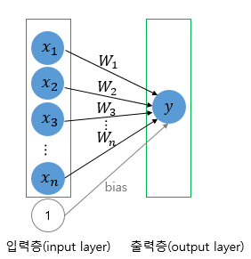
  </p>

<br/>

#### Multi-Layer Perceptron (MLP, 다층 퍼셉트론)

- 입력층과 출력층 사이에 존재하는 층을 **은닉층(hidden layer)**

- 중간에 은닉층이 존재한다는 점이 단층 퍼셉트론과의 차이점

  <p align="center">
      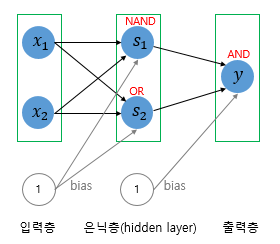
      <div align="center">AND, NAND, OR 게이트를 조합하여 XOR 게이트를 구현한 다층 퍼셉트론의 예시</div>
  </p>

<br/>

<p align="center">
    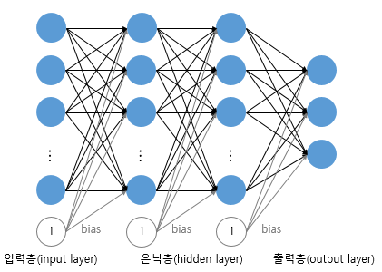
</p>

<br/>

#### Deep Neural Network (DNN, 심층 신경망)

- 은닉층이 2개 이상인 신경망을 **심층 신경망(Deep Neural Network, DNN)**이라 함
- 일반적인 인공신경망과 마찬가지로 복잡한 비선형 관계(Non-Linear Relationship)들을 모델링할 수 있음

<br/>

---

<br/>

### 신경망(Neural Network)의 구조

#### 인공신경망(Artificial Neural Networks, ANN)의 개요

<p align="center">
    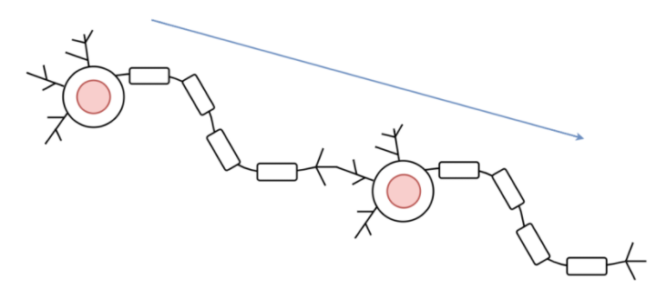
    <div align="center">신경망의 구성</div>
</p>

- 기본적으로 하나의 뉴런은 입력(X)를 받아서 출력(Y)을 만들어 다음 뉴런에게 전달

- 퍼셉트론(=출력 Y)은 입력 신호(X)에 가중치(W)를 곱한 값에 편향(b)을 합하고, 합한 값이 0을 넘으면 활성화, 넘지 않으면 비활성화

  ```
  Y = Activation Function(X * W + b)
  ```

  - 가중치란?
    - 각 입력 신호가 **결과 출력에 미치는 중요도를 조절**하는 매개변수
  - 편향이란?
    - **뉴런의 활성화를 조절**하는 매개변수
    - **뉴런의** **활성화 조건을 설정**하는 매개변수

<br/>

#### 깊은 DNN 모델 학습의 문제점

- 그래디언트 소실(vanishing gradient) 또는 폭주(exploding)가 발생할 수 있음
- 모델이 복잡하고 커질수록 학습시간이 매우 느려짐
- 모델이 복잡할수록 오버피팅(overfitting)될 위험이 큼


<br/>

----

<br/>

### Activation Function

- 출력값을 ANN에 적합하게 바꿔주는 역할 수행

- 입력을 받아서 활성화 또는 비활성화를 결정하는 데에 사용되는 함수

  <p align="center">
      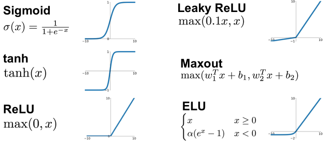
  </p>

<br/>

#### Sigmoid

- Logistic 함수라고 불리기도 하며, x의 값에 따라 0~1의 값을 출력하는 S자형 함수

  <p align="center">
      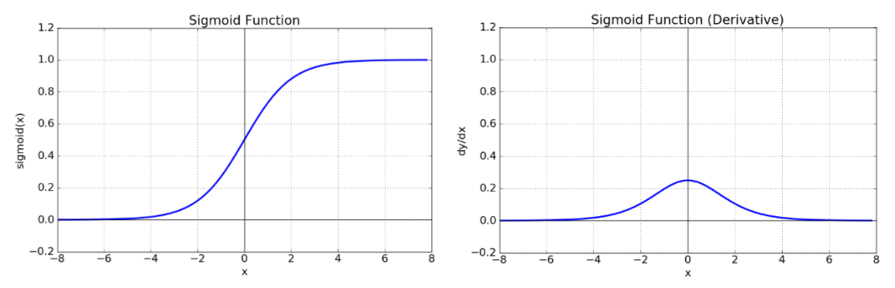
      <div align="center">Sigmoid 함수(좌) & Sigmoid 도함수(우)</div>
  </p>

- 미분 계수를 기울기 혹은 Gradient값이라고 함
- Sigmoid 함수는 음수 값을 0에 가깝게 표현하기 때문에 입력 값이 최종 레이어에서 미치는 영향이 적어지는 ***Vanishing Gradient Problem**이 발생

###### *Vanishing Gradient Problem (기울기 소멸 문제)

- 깊은 심층신경망에서는 역전파 알고리즘이 입력층으로 전달됨에 따라 그래디언트가 점점 작아져 결국 가중치 매개변수가 업데이트 되지 않는 경우가 발생

<p align="center">
    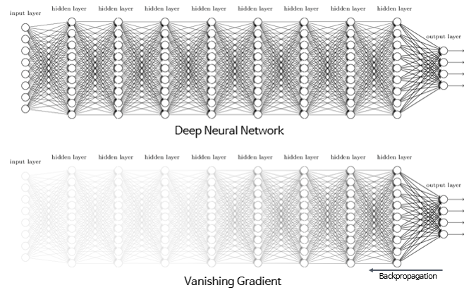
</p>

###### ***Exploding Gradient (그래디언트 폭주)**

- 그래디언트 소실과는 반대로 ***역전파**에서 그래디언트가 점점 커져 입력층으로 갈수록 가중치 매개변수가 기하급수적으로 커지게 되는 경우
- 이 경우에는 발산(diverse)하게 되어 학습이 제대로 이루어지지 않음

<br/>

#### Backpropagation

- 각 뉴련들은 모두 제각각의 많은 가중치와 바이어스 값의 조합을 가지고 있으며, 전파되는 과정에서 가중치와 Bias 값을 조절하게 됨

- 단순히 데이터를 오른쪽으로만 전달하면 데이터 최적화가 잘 이루어지지 않기때문에, 결과값에서 오차가 발생하면 해당 오차만큼 앞쪽으로 다시 전파시키면서 가중치를 갱신하는 것

  <p align="center">
      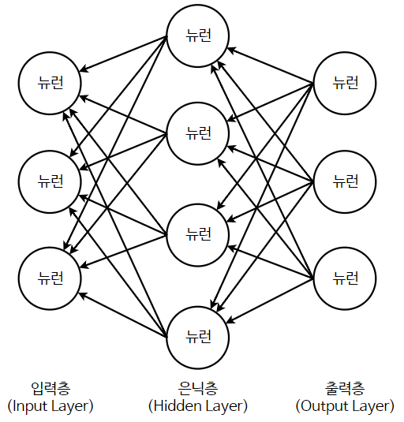
      <div align="center">역전파 (Backpropagation)</div>
  </p>

<br/>

#### Tanh

- Hyperbolic Tangent Function은 쌍곡선 함수 중 하나로, Sigmoid 함수를 변형해서 얻을 수 있음

  <p align="center">
      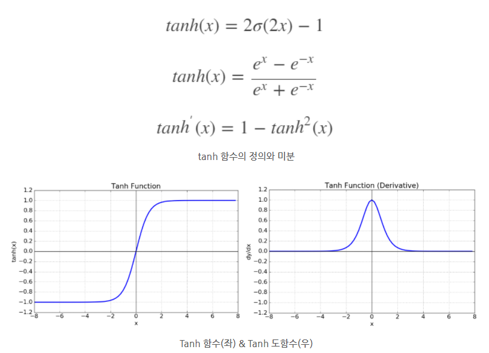
  </p>

- tanh 함수는 함수의 중심점을 0으로 옮겨 sigmoid가 갖고 있던 최적화 과정에서 느려지는 문제를 해결
- 하지만 미분함수에 대해 일정 값 이상에서 미분 값이 소실되는 Vanishing Gradient Problem은 여전히 남아있음

<br/>

#### ReLU

- ReLU(Rectified Linear Unit, 경사함수)는 가장 많이 사용되는 활성화 함수 중 하나

- Sigmoid와 tanh가 갖는 Gradient Vanishing 문제를 해결하기 위한 함수

  <p align="center">
      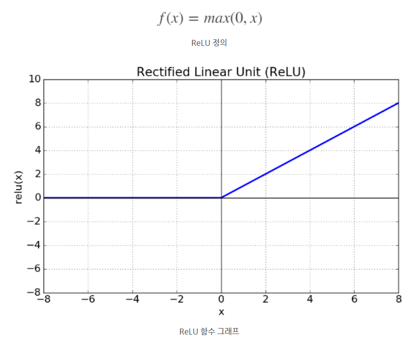
  </p>

- x가 0보다 크면 기울기가 1인 직선, 0보다 작으면 함수 값이 0

- 0보다 작은 값들에서 뉴런이 죽을 수 있는 단점

- sigmoid, tanh 함수보다 학습이 빠르고, 연산 비용이 적고, 구현이 매우 간단하다는 특징

<br/>

----

<br/>

### DNN의 높은 시간 복잡도

- 오차역전파법(Backpropagation)과 경사 하강법(Gradient Descent)은 구현의 용이함과 국지적 최적화(local optima)에 잘 도달한다는 특성이 있어서 선호되어 옴, 하지만 시간 복잡도가 매우 높음
- 심층 신경망을 학습시킬 때에는 크기(계층의 수 와 계층 당 유닛 수), 학습률, 초기 가중치 등 많은 매개변수(parameter)들이 고려되어야 함
- 하지만 최적의 매개변수들을 찾기 위해 매개변수 공간 전부를 확인하는 것은 계산에 필요한 시간과 자원의 제약으로 인해 불가능
- 시간 복잡도를 해결하기 위해, **미니 배치(mini batch), 드롭 아웃(drop out)**과 같은 방법론 등장

<br/>

#### Batch

- 배치는 가중치 등의 매개 변수의 값을 조정하기 위해 사용하는 데이터의 양

<br/>

-----

<br/>

### **옵티마이저 (Optimizer)**

<p align="center">
    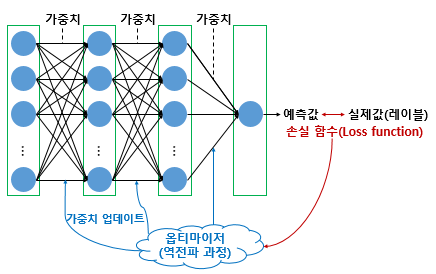
</p>

- 손실 함수의 값을 줄여나가면서 학습하는 방법은 어떤 옵티마이저를 사용하느냐에 따라 달라짐

<br/>

#### BGD (Batch Gradient Descent, 배치 경사 하강법)

- 전체 데이터를 기준으로 가중치를 업데이트

- 모든 데이터에 대한 cost 값을 계산하고 평균을 낸 후에야 한 번 가중치가 업데이트

- 에포크당 시간이 오래 걸리며, 메모리를 크게 요구한다는 단점

  <p align="center">
      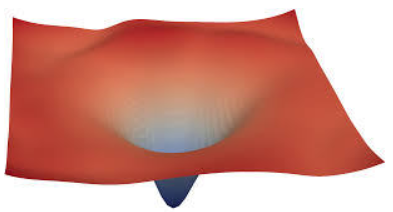
      <div align="center">Batch Problem Space</div>
  </p>

<br/>

#### SGD (Stochastic Gradient Descent, 확률적 경사 하강법)

- 개별 데이터를 기준으로 가중치를 업데이트

- 매개변수의 변경폭이 불안정하고, 때로는 배치 경사 하강법보다 정확도가 낮을 수도 있음

  <p align="center">
      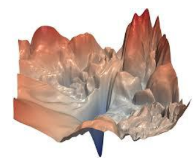
      <div align="center">SGD Problem Space</div>
  </p>

<br/>

#### Mini-Batch

- Batch와 SGD의 절충안

- 모든 데이터에 대해서 가중치 평균을 구하는 것이 아니라 전체 데이터에서 일부 데이터를 묶음방식으로하여 데이터 학습을 진행시키는 방식

  <p align="center">
      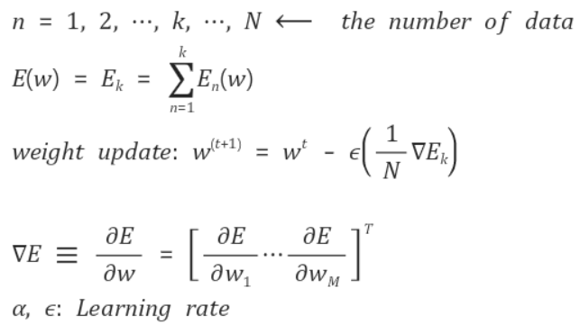
  </p>

<br/>

#### 모멘텀(Momentum)

```python
keras.optimizers.SGD(lr = 0.01, momentum= 0.9)
```

- 모멘텀은 경사 하강법에서 계산된 접선의 기울기에 한 시점(step) 전의 접선의 기울기값을 일정한 비율만큼 반영

  <p align="center">
      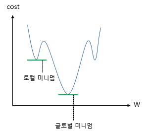
  </p>

<br/>

#### **Adagrad** (Adaptive Gradient)

```python
keras.optimizers.Adagrad(lr=0.01, epsilon=1e-6)
```

- 아다그라드는 각 매개변수에 서로 다른 학습률을 적용
- 변화가 많은 매개변수는 학습률이 작게 설정되고 변화가 적은 매개변수는 학습률을 높게 설정

<br/>

#### RMSprop

```python
keras.optimizers.RMSprop(lr=0.001, rho=0.9, epsilon=1e-06)
```

- 아다그라드는 학습을 계속 진행한 경우에는, 나중에 가서는 학습률이 지나치게 떨어진다는 단점이 있는데 이를 다른 수식으로 대체하여 이러한 단점을 개선

<br/>

#### Adam

```python
keras.optimizers.Adam(lr=0.001, beta_1=0.9, beta_2=0.999, epsilon=None, decay=0.0, amsgrad=False)
```

- 아담은 알엠에스프롭과 모멘텀 두 가지를 합친 듯한 방법
- 방향과 학습률 두 가지를 모두 잡기 위한 방법

<br/>

<p align="center">
    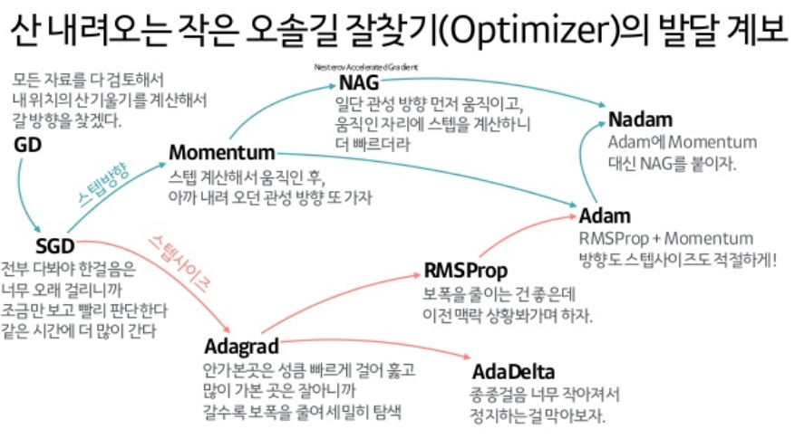
</p>

<br/>

#### 드롭아웃(Dropout)

- 드롭아웃은 학습 과정에서 신경망의 일부를 사용하지 않는 방법

- 드롭아웃의 비율을 0.5로 한다는 것은 학습 과정마다 랜덤으로 절반의 뉴런을 사용하지 않고, 절반의 뉴런만을 사용한다는 것

  <p align="center">
      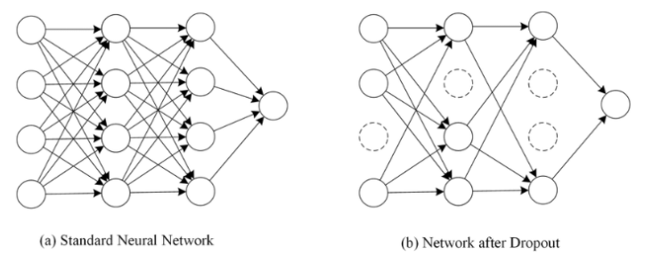
  </p>

- 학습 시에만 사용하고, 예측 시에는 사용하지 않는 것이 일반적

- 학습 시에 인공 신경망이 특정 뉴런 또는 특정 조합에 너무 의존적이게 되는 것을 방지

- 매번 랜덤 선택으로 뉴런들을 사용하지 않으므로 서로 다른 신경망들을 앙상블하여 사용하는 것 같은 효과를 내어 과적합을 방지

  ```python
  model = Sequential()
  model.add(Dense(256, input_shape=(max_words,), activation='relu'))
  model.add(Dropout(0.5))
  model.add(Dense(128, activation='relu'))
  model.add(Dropout(0.5))
  model.add(Dense(num_classes, activation='softmax'))

---

- 다층신경망
  - ANN의 은닉층을 깊게 쌓아 만든 딥러닝 모델들이 등장
  - DNN 응용 알고리즘에는, CNN, RNN, LSTM, GRU 등이 있음

---

<br/>

### Hierarchical Temporal Memory (HTM networks)

- 기존의 심층 학습(Deep learning)이나 인공 신경망 모델(Artificial Neural Networks Model)과는 구별

  <p align="center">
      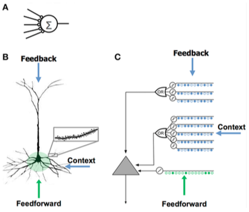
      <div align="center">Comparing the artificial neural network (A), the biological neuron (B), and the HTM neuron (C).</div>
  </p>

- Hidden Layer안의 Neuron 끼리도 정보를 공유

- 일반 NN보다 더 많은 Edge를 갖는 Nertworks

- 계층적 구조를 형성하며 알고리즘이 내제적으로 시간적인 데이터를 고려하도록 만들어진 기계학습 기법

- HTM 네트워크는 시간에 따라 변화되는 많은 양의 데이터를 훈련하며 많은 양의 시퀀스들과 패턴들을 저장하는 네트워크

- HTM이 기둥 구조를 가지고 있으며 이러한 기둥 구조가 패턴을 pooling하는 역할

- 시계열 분석을 이용한 이상탐지 모델에 주로 사용

<br/>

----

- 딥러닝 방식

  - 강화학습(Reinforcement Learning)

    - 강화학습의 개요
    - MDP(Markov Decision Process) 방식
    - DQN(Deep Q-Network)
    - 강화학습의 특징

  - GPU 방식 병렬컴퓨팅

    - GPU(Graphics Processing Unit, 그래픽 처리 장치)

    - GPGPU(General Purpose Graphics Processing Units)
      - MPI(Message Passing Interface, 메시지 전달 인터페이스)
      - CUDA(Compute Unified Device Architecture, 쿠다)

      - OpenCL(Open Computing Language)
      - TPU(Tensor Processing Unit, TPU)

<br/>

## 모델 평가

### 모델의 분류와 정답

- 모델을 평가하는 요소는 결국, 모델이 내놓은 답과 실제 정답의 관계로써 정의를 내릴 수 있음

  <p align="center">
      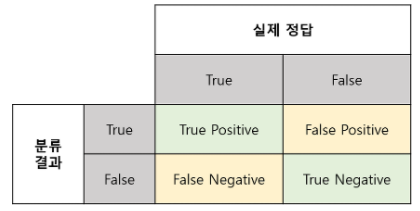
  </p>

  - True Positive(TP) : 실제 True인 정답을 True라고 예측 (정답)
  - False Positive(FP) : 실제 False인 정답을 True라고 예측 (오답)
  - False Negative(FN) : 실제 True인 정답을 False라고 예측 (오답)
  - True Negative(TN) : 실제 False인 정답을 False라고 예측 (정답)

<br/>

#### Precision (정밀도)

<br/>

#### Recall(재현율)

<br/>

#### ROC curve

- 보통 binary classification 이나 medical application에서 많이 쓰는 성능 척도

<br/>

#### AUC (Area Under the Curve)

- ROC curve 아래 면적을 AUC라 함

<br/>

#### ROC curve를 쓰는 이유

- 클래스별 분포가 다를 때, Accuracy의 단점을 보완하면서 더 자세히 보기 위함

  <p align="center">
      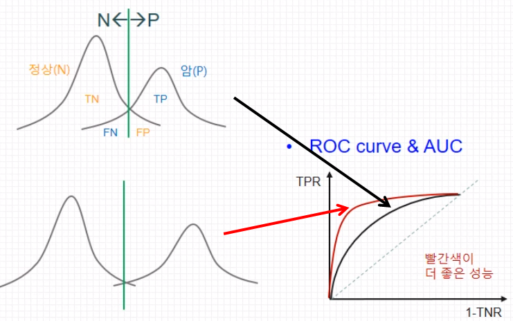
  </p>

  - 겹치는 영역이 많다면, 초록선을 움직여도 error가 많이 발생
  - 겹치는 영역이 많을 수록 직선에 가까워지게 됨

<br/>

<br/>

## 기계학습

- 클러스터링(Clustering)과 기계학습
- 기계번역

<br/>

## 딥러닝 기술 동향

- 개요

---

<br/>

### RNN 과 LSTM, GRU

#### 순환신경망(Recurrent neural networks)

- RNN 알고리즘은 반복적이고 순차적인 데이터(Sequential data)학습에 특화된 인공신경망의 한 종류

- 내부의 순환구조가 들어있는 특징

- 순환구조를 이용하여, 과거의 학습을 Weight를 통해 현재 학습에 반영

- 음성 Waveform을 파악하거나(Machine Translation) , 텍스트의 문장 앞 뒤성분을 파악할 때(Named Entity Recognition), 주로 사용

  <p align="center">
      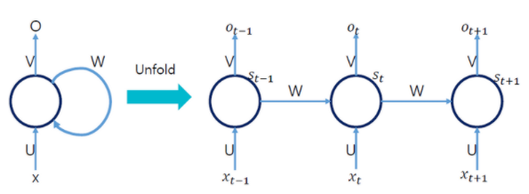
  </p>

- 이 RNN 단점은 처음시작한 Weight의 값이 점차 학습이 될 수록 상쇄 된다는 것이였는데, 이를 보완한 알고리즘이 LSIM(Long Short Term Memory Network) 알고리즘

<br/>

#### LSTM(Long-short term memory, 장단기 기억 구조)

- LSTM알고리즘은 Cell State라고 불리는 특징층을 하나 더 넣어 Weight를 계속 기억할 것인지 결정
  - Gradient Vanishing의 문제를 해결
- LSTM은 과거의 data를 계속해서 update 하므로, RNN보다 지속적
- Cell state는 정보를 추가하거나 삭제하는 기능을 담당
- LSTM의 장점은 각각의 메모리 컨트롤이 가능하다는 점과 결과값이 컨트롤이 가능
- 메모리가 덮어씌워질 가능성이 있고, 연산속도가 느리다는 단점

<br/>

#### GRUs (Gated Recurrent Units)

- LSTM을 변형시킨 알고리즘으로, Gradient Vanishing의 문제를 해결
- 초기의 weight가 계속 지속적으로 업데이트되었지만, GRUs는 Update Gate와 Reset Gate를 추가하여, 과거의 정보를 어떻게 반영할 것인지 결정
- Update Gate는 과거의 상태를 반영하는 Gate이며, Reset Gate는 현시점 정보와 과거시점 정보의 반영 여부를 결정
- GRUs의 장점은 연산속도가 빠르며, 메모리가 LSTM처럼 덮여 씌여질 가능성이 없다. 그러나 메모리와 결과값의 컨트롤이 불가능하다는 단점

<br/>

---

- 컨볼루션 네트워크(CNN, convolutional neural networks, 합성곱신경망)
- GAN(Generative Adversarial Network. 생성 대립 신경망)
- 이미지인식 기술
- 자연어 처리(Natural Language Processing, NLP)
  - 자연어 처리(NLP) 개요
    - Word2Vec
    - RNN과 자연어 처리
    - CNN과 자연어 처리
  - 자연어 처리와 인공지능비서
    - 질의응답 시스템(question-answering system)
    - 대화시스템

<br/>

<br/>

## Reference

- [텐서 플로우 블로그 - 딥러닝이란 무엇인가?](https://tensorflow.blog/%EC%BC%80%EB%9D%BC%EC%8A%A4-%EB%94%A5%EB%9F%AC%EB%8B%9D/1-%EB%94%A5%EB%9F%AC%EB%8B%9D%EC%9D%B4%EB%9E%80-%EB%AC%B4%EC%97%87%EC%9D%B8%EA%B0%80/)
- [안경잡이개발자 - ANN의 원리](https://m.blog.naver.com/PostView.naver?blogId=ndb796&logNo=221280341708&proxyReferer=https:%2F%2Fwww.google.com%2F)
- [TCP School - 딥러닝에서 사용되는 알고리즘](http://tcpschool.com/deeplearning/deep_algorithm1)
- [Tistory - HTM](https://dodonam.tistory.com/214)
- [Tistory - ROC, AUC](https://nittaku.tistory.com/297)

